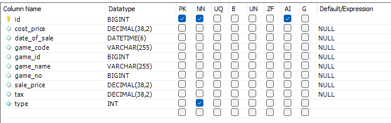
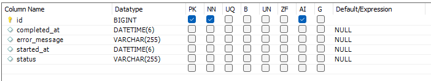

Spring Boot CSV Import API

A Spring Boot application that imports data from CSV files into a MySQL database using OpenCSV. The API supports asynchronous processing and tracks progress using a progress service.

🚀 Features

CSV Import: Import data from CSV files into the MySQL database.

Asynchronous Processing: Uses CompletableFuture for non-blocking imports.

Progress Tracking: Track the status of the import (IN_PROGRESS, COMPLETED, FAILED).

Error Handling: Detailed error messages for failed imports.

Game Sales API: Retrieve and analyze game sales data.

⚙️ Prerequisites

Java 17+

Maven 3.6+

MySQL 8+

📂 Project Structure

├── src/main/java
│   ├── net.assessment.springboot
│   │   ├── controller
│   │   │   └── ImportController.java
│   │   │   └── GameSaleController.java
│   │   ├── service
│   │   │   ├── ImportService.java
│   │   │   └── ProgressService.java
│   │   ├── model
│   │   │   ├── Game.java
│   │   │   └── Progress.java
│   │   └── repository
│   │       ├── GameRepository.java
│   │       └── ProgressRepository.java
├── src/main/resources
│   └── application.properties
└── pom.xml

📂 Database Structure

game table:

progress table:

⚙️ Configuration

application.properties

spring.datasource.url=jdbc:mysql://localhost:3306/your_database
spring.datasource.username=your_username
spring.datasource.password=your_password
spring.jpa.hibernate.ddl-auto=update
management.endpoints.web.exposure.include=*

Installation and Running

Clone the Repository

git clone https://github.com/your-repo/csv-import-api.git
cd csv-import-api

Build the Application

mvn clean install

Run the Application

mvn spring-boot:run

📄 API Endpoints

1. Import CSV

URL: /api/import

Method: POST

Request:

multipart/form-data with the CSV file.

curl -F "file=@/path/to/yourfile.csv" http://localhost:8080/api/import

Response:

{
  "message": "Import started successfully."
}

2. Get Game Sales

URL: /api/getGameSales

Method: GET

Query Parameters:

page (default 0)

size (default 100)

fromDate (optional, format yyyy-MM-dd'T'HH:mm:ss)

toDate (optional, format yyyy-MM-dd'T'HH:mm:ss)

price (optional, for price filtering)

priceCondition (optional, greater or less)

Example:

curl -X GET "http://localhost:8080/api/getGameSales?page=1&size=50"
curl -X GET "http://localhost:8080/api/getGameSales?price=50&priceCondition=greater"
curl -X GET "http://localhost:8080/api/getGameSales?fromDate=2024-01-01T00:00:00&toDate=2024-12-31T23:59:59"

3. Get Total Sales

URL: /api/getTotalSales

Method: GET

Query Parameters:

fromDate (required, format yyyy-MM-dd'T'HH:mm:ss)

toDate (required, format yyyy-MM-dd'T'HH:mm:ss)

gameNo (optional, filter by game number)

Example:

curl -X GET "http://localhost:8080/api/getTotalSales?fromDate=2024-01-01T00:00:00&toDate=2025-12-31T23:59:59&gameNo=2"

📂 Sample CSV Format

1,1001,GameName1,Code001,1,100.50,5.00,120.00,2025-03-16 12:00:00
2,1002,GameName2,Code002,2,150.00,7.50,170.00,2025-03-16 13:00:00

Columns: gameId, gameNo, gameName, gameCode, type, costPrice, tax, salePrice, dateOfSale

